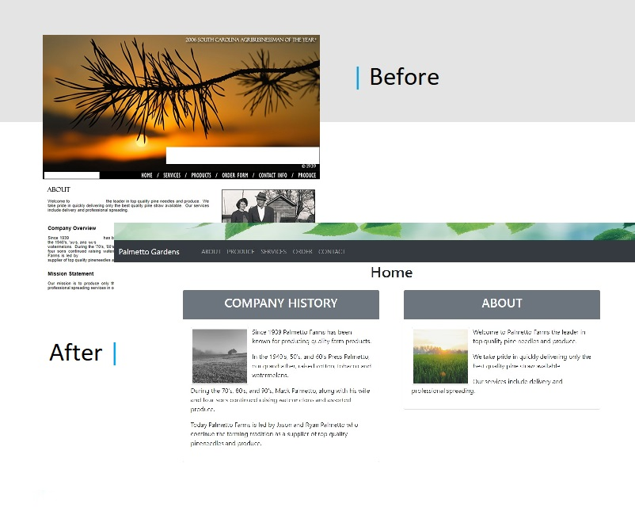
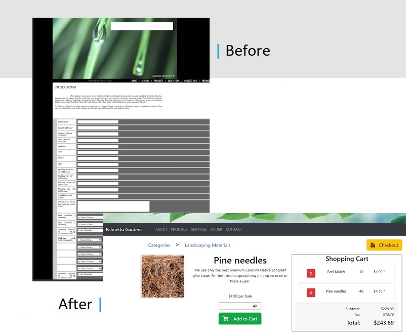

<h1 align="center">Welcome to Palmetto Gardens 👋</h1>

  
  
  

> Using a website I recently visited as a model to build up my REACT skills. The original site is a six page site with a contact form that submits an email to the buisness and an order form which the user can enter their name and address and select the products they would like to purchase. Upon submitting, the form data is sent via email to the buisness. The rest of the pages were static web pages with info about the business and its products and services.

> I used React and Bootstrap to give the pages a modern look and is responsive to the device size. The data on the pages is contained in a MySql database and is easily customizable.

> Instead of a one page form, the new single page application includes the ability to look for items of interest by category and build a shopping cart which gives the user the total.

<h2>Technology</h2>
<ul> 
  <li>JavaScript</li>
  <li>HTML/CSS</li> 
  <li>Bootstrap</li> 
  <li>MySql</li>
  <li>Node.js</li>
  <li>React.js</li>     
</ul>

<h2>Packages</h2>
<ul> 
  <li>Axios</li>
  <li>Express</li>
  <li>Nodemailer</li>
  <li>Sequelize</li> 
</ul>

### ✨ [Demo](1)

## Author

👤 **Chris Ross**

- Website: https://vtchris.github.io/portfolio/
- Twitter: [@vtchris_2357](https://twitter.com/vtchris_2357)
- Github: [@vtchris](https://github.com/vtchris)
- LinkedIn: [@chrisross2357](https://www.linkedin.com/in/chrisross2357/)

## Show your support

Give a ⭐️ if this project helped you!

---

_This README was generated with ❤️ by [readme-md-generator](https://github.com/kefranabg/readme-md-generator)_
